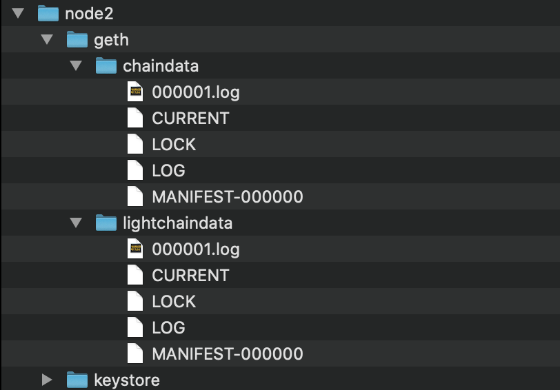
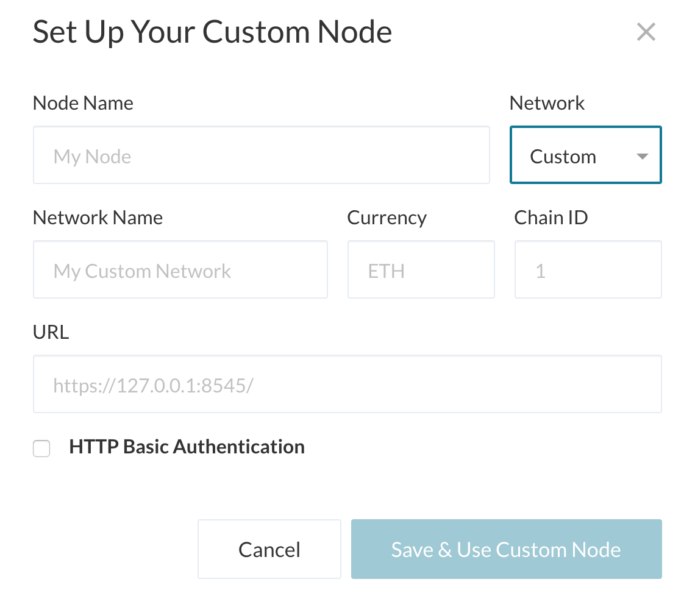

# blockchain_testnet_hw

### Block Chain Test Net
## Launching the Blockchain
# In this process we have created a genesis network which allows us to run nodes and record transactions and seal blocks on our local blockchain netwok. 

The blockchain network was built using geth etherum tools. Specifically a tool called puppeth was used to create a new genesis network. In otherwords to initialize the basics of our new local blockchain.

The following will describe the basics of the information that is essential to this blockchain network and how to launch the network and implement it to complete a test transaction using the MyCrypto app.

-------

## Creating the Network
Important information to note here is that we created a network with 2 nodes that each have an account with a unique address. See the following process that was done.

* Create Node Accounts 
    Enter directory for the test net.
    Call the blockchain tools.

    *../blockchain-tools/geth account new --datadir node1*

    *../blockchain-tools/geth account new --datadir node2*

* Create Address for Accounts
    Public Address of Accounts obtained. This is the type of out put that should be seen in terminal after running the node creation commands.
    NODE 1
    Public address of the key:   **0x2f179Ecc81944aE9a7FB0329aFA5188aea656A13**
    NODE 2
    Public address of the key:   **0xbE7BC4c044c79b3D0f55C7cA44c9b20D7a0043e2** 

* Create the Genesis Net using the puppeth tool.   

    *../blockchain-tools/puppeth*

    

* Name the Network

    The network must be named when prompted.

* Configure a new genesis block from scratch.
    

* Choose Clique Proof of Authority algorithm.
    
    The is an option for proof of work or proof of authority style consensus algorithm. For this test network we are choosing to run on proof of authority. This means that the validity of an item is proved by digital signature and pure ownership.

    

* Define the block time.
    
    We have left this at the default of 15 seconds for one block to complete and seal on our test network blockchain.

* Add the node account addresses and prefund them.
    
    The account addresses that were created for each new node must be added to be able to be sealed and prefunded with some funds that can be used for testing on the test network.

    

* Define a chain ID.
    
    The chain ID can be defined as any number with at least 3 digits. It has been set as 333 for this test net.

    

* Export the configuration to get testnet18.json file.
    
    Follow the prompts to select export genesis.

    
    

## Run the Network
* Initialize the nodes
    
    Initialize Node 1

    *../blockchain-tools/geth init testnet18.json --datadir node1*

    

    Initialize Node 2
    
    *"../blockchain-tools/geth init testnet18.json --datadir node2"*

    

* Check the network directory to ensure proper accounts and nodes are formed. 
    
    Node 1 should show as follows in the directory or tree. With a geth folder that holds chain data, lightchaindata and a keystore file which is private to the node account.

    

    Node 2 should show the same as follows in the directory or tree. With a geth folder that holds chain data, lightchaindata and a keystore file which is private to the node account.

     

* Start the First Node
    Note: First node is in mining and rpc mode.
    
    *../blockchain-tools/geth --datadir node1 --unlock "0x2f179Ecc81944aE9a7FB0329aFA5188aea656A13"--allow-insecure-unlock —-mine --rpc —-minerthreads 1*

The geth tools used to start node 1 are --datadir which tells which node to start running and --mine which tells the node to start mining on the blockchain. Additionally --rpc which connects it to a port to communicate with an external network item such as mycrypto which we will use to demonstrate a transaction on the network. The other commands --unlock "address" unlocks the wallet in an attempt to seal the block and --allow-insecure-unlock was used to go around error for http.

* Start the Second Node
    Note: Second node is also in mining mode with a bootnode to the enode of node 1.
       
    *../blockchain-tools/geth --datadir node2 --unlock "0xbE7BC4c044c79b3D0f55C7cA44c9b20D7a0043e2" --allow-insecure-unlock --port 30305 —-mine —-minerthreads 1 --bootnodes "enode://c534e0430d54943398949078ff14952e74e07f67deef5886f54a791b967cf3960e74d60337dfef2055a6fead327eed279d58e91b12b452c3aa3288f5b29305ed@127.0.0.1:30303"*

The geth tools used to start node 2 are again --datadir to specify the directory of the node that is to be started should be that of node 2 and again --mine since we want both nodes to be mining. What is different for the second node is that --port is used to specify that the second node use a different port to run that the first node (which by default ran on port 30303). Additionally, a --bootnodes needs to be used to connect the second node with reference to the first nodes enode address. The other commands --unlock "address" unlocks the wallet in an attempt to seal the block and --allow-insecure-unlock was used to go around error for http.

-----

## Connect MyCrypto to the Network
In ordrer to connect my crypto to the network, a new network custom node must be created. When creating the node, the Node Name and the Network Name must be both the the new genesis block test network name which was created and saved in the .json format (testnet18). The chain ID must be specified as the chain ID we created for the genesis block (333). Additionally, ETH should be used as the currency (ETH). And the URL will be placed as http ://127.0.0.1:8545/ as it will only be run locally. 

Once the values stated above are placed and save & used custom node is chosen, you can view your test net on the side bar as an option in the list of networks.

Be sure the testnet18 is selected as your network before making test transactions.

----

## Send a Transaction on the Test Network

Open the wallet by selecting keystore file from the test net directory for node 1.
Then go to your wallet home page and you will see where you can send a transaction.
Enter the amount you want to send in the amount space for ETH and paste the address of node2 in the to address space.
Then click send transaction.

Confirm that the address and amount are correct for the transaction before confirming to send. 

Once the transaction is sent there will be a green box appearing and to view the status select the check TX status button.

Then you will view that the transaction is pending until the block has sealed and confirmed the transaction. 

If you go to your wallet again and check recent transactions you will see it in the list of recent transactions. Then if you were to unlock the wallet address for node2 you should see that the transaction was received.

